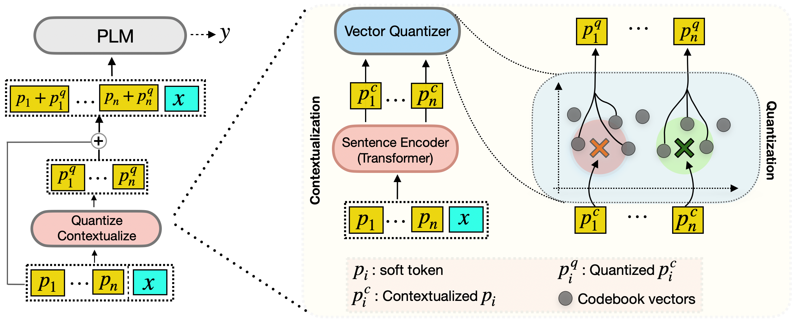

# VIP-Based Prompting for Parameter-Efficient Learning

This repository contains code of the paper

`Vector-Quantized Input-Contextualized Soft Prompts for Natural Language Understanding` (EMNLP 2022)

_link to the draft:_ [here](https://arxiv.org/abs/2205.11024)


## Motivation

Prompt Tuning has been largely successful as a parameter-efficient method of conditioning large-scale pre-trained language models to perform downstream tasks. Thus far, soft prompt tuning learns a fixed set of task-specific continuous vectors, i.e., soft tokens that remain static across the task samples. A fixed prompt, however, may not generalize well to the diverse kinds of inputs the task comprises. In order to address this, we propose Vector-quantized Input-contextualized Prompts (VIP) as an extension to the soft prompt tuning framework. VIP particularly focuses on two aspects---contextual prompts that learns input-specific contextualization of the soft prompt tokens through a small-scale sentence encoder and quantized prompts that maps the contextualized prompts to a set of learnable codebook vectors through a Vector quantization network. On various language understanding tasks like SuperGLUE, QA, Relation classification, NER and NLI, VIP outperforms the soft prompt tuning (PT) baseline by an average margin of 1.19%. Further, our generalization studies show that VIP learns more robust prompt representations, surpassing PT by a margin of 0.6% - 5.3% on Out-of-domain QA and NLI tasks respectively, and by 0.75% on Multi-Task setup over 4 tasks spanning across 12 domains.

- [ ] Here is the architecture summarizing approach-



## Installation

We will first install torch version and then we will install other dependencies specific to this repository as well as [OpenPrompt](https://raw.githubusercontent.com/thunlp/OpenPrompt/main) repository.

- Torch

```
pip install torch==1.8.1+cu111 torchvision==0.9.1+cu111 torchaudio==0.8.1 -f https://download.pytorch.org/whl/torch_stable.html
```

- Other dependencies
```
pip install -r ./requirements.txt
```

## Quick check of setup
Let's check if everything is working fine by running an example script on Commitment Bank (CB). 

Run the following command inside src/

```console
python train.py --cfg '../cfgs/cb.yaml' 
```

## How to run
If the above command runs fine, let's see how to specify datasets and arguments.

```console
python train.py [mandatory: --cfg <configuration file>] [optional: --parameter1 <setting1> --parameter2 <setting2> ...]
```

- [x] Configuration: It is **mandatory** to specify path to the config file cfg. It sets up the prompting system including plm, number of soft and cq prompts, etc. We have put all the config files in the directory cfg/. For reference, please look at 'cfgs/cb.yaml'.


- [x] Arguments: It is **optional** to specify the following parameters as arguments. For instance,

Note: Arguments overwrite parameters specified by config file.

```console
python train.py --cfg cfgs/cb.yaml --num_soft_tokens 0 --num_cq_tokens 100
```

#### Parameters
* cfg: configuration file
* model: t5-lm (model class)
* model_name_or_path: google/t5-base-lm-adapt (pretrained models)
* model_parallelize: True if want to parallelize model across GPUs
* tune_plm: False of want to keep the plm frozen
* plm_eval_mode: turn-off the drop-out in the frozen model
* num_soft_tokens: number of soft tokens
* num_cq_tokens: number of quantized tokens
* init_from_vocab: if prompt tokens to be initialized from vocab
* template: path to template file, for instance, "../verbalizer_template/cb_tem.txt"
* verbalizer: path to verbalizer file, for instance, "../verbalizer_template/cb_vb.txt"
* dataset: name of the dataset (used to download data from huggingface)
* eval_on_test: test set is used for evaluation, False will evaluate on validation set
* batch_tr: training batch
* batch_te: batch for evaluation
* lr_soft_prompt: learning rate for the standard soft prompts
* lr_cq_prompt: learning rate for the quantized prompt setup, i.e., CQ module.
* eval_every_steps: evaluate after these many steps. -1 denotes epoch-wise evaluation.lr_cq_prompt
* max_steps: maximum number of gradient steps to run the training
* num_codes: number of codebook vectors. -1 value denotes num_codes=10 * num_cq_tokens
* temp: temperature parameter to normalize distances of codebook vecs from contextual prompts
* num_codebook_samples: number of multinomial samples of codebook vecs.
* commitment_cost: commitment of sentence encoder's output to codebook vectors.
* identifier: identifier of the particular setting. It will important while saving model checkpoints.
* result_path: path where results are saves, for instance, ../results/cb.txt
* use_cuda: True


## Supported tasks and benchmark datasets
- SuperGLUE
- MRQA
- ANLI
- CoNLL
- TACRED
- SemEval


## CQ module
_[Please use this to refer to/modify source code of CQ module]_
- The function for CQ module is written in `src/prompt_gen_module.py`
- CQ is called by soft_template in `OpenPrompt/openprompt/prompts/soft_template.py`


## Citation
```bibtex
@article{vip2022prompts,
  title={Vector-Quantized Input-Contextualized Soft Prompts for Natural Language Understanding},
  author={Rishabh Bhardwaj, Amrita Saha, Steven C.H. Hoi, and Soujanya Poria}
  conference={EMNLP},
  year={2022}
}
```

**Note**: Please cite our paper if you find this repository useful. The latest version is available [here](https://arxiv.org/abs/2205.11024).

